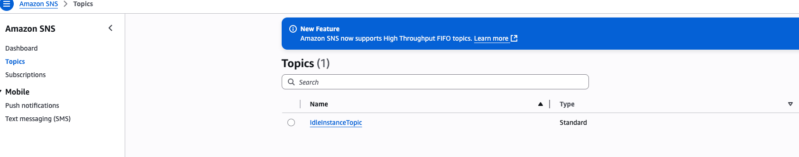

# Cloud Cost Optimizer with AWS

## Project Overview
This project automates **EC2 cost optimization**. Idle EC2 instances are automatically stopped using **AWS Lambda** triggered by **CloudWatch alarms**. Metrics are visualized using **Grafana Cloud**.

---

## Architecture

**Flow:**
1. EC2 instances run workloads.
2. CloudWatch collects CPU metrics.
3. CloudWatch alarm triggers when CPU < 10% for 5 minutes.
4. SNS notifies Lambda function.
5. Lambda stops idle EC2 instances.
6. Grafana visualizes metrics in real-time.

---

## Screenshots

### 1. EC2 CPU Metrics
These graphs show CPU usage over time.

---

### 2. SNS Topic
This screenshot shows the SNS topic setup that triggers the Lambda function.

---

### 3. Lambda Function
This screenshot shows the Lambda function code that stops idle EC2 instances.

---

### 4. EC2 Stop Action
When the Lambda is triggered, this is how the EC2 instance stops.

---

### 5. CloudWatch Alarm
This screenshot shows the CloudWatch alert email notification when CPU drops below the threshold.

---
## How It Works  

1. **Terraform provisions all resources**: EC2 instance, CloudWatch alarms, SNS topic, Lambda function.  
2. **CloudWatch monitors** CPU utilization of EC2.  
3. If CPU < threshold (e.g., 10%) for the defined period (e.g., 5 minutes), CloudWatch triggers **SNS alert**.  
4. **Lambda function**, subscribed to SNS, stops the idle EC2 instance automatically.  
5. Optionally, **Grafana Cloud** visualizes CPU metrics and EC2 status in dashboards.

